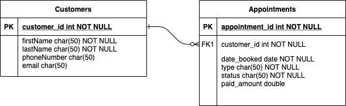

# Customer-Booking-System
A customer booking system for a local small buisness. Built with the Spring Framework. This RESTful service will serve as the backend for a small buisness' website.
The booking system implements the following features:  
1) All customer appointments are tracked.  
2) The system should send out reminders to both the client and the admin 24 hours before an a appointment.
3) No two time slots will be the same. 

## Database:
Because it is free and easy to use the database used to support this system will be MongoDB Atlas. 

## Data Model

